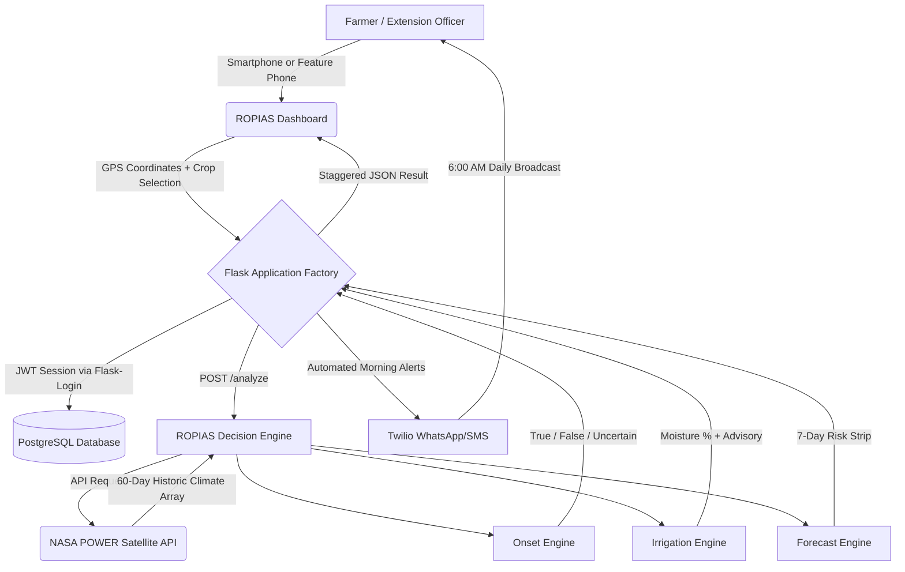

<div align="center">
    <picture>
      <source media="(prefers-color-scheme: dark)" srcset="app/static/img/logo-dark.png">
      
    </picture>

# ROPIAS

### Rainfall Onset Prediction & Irrigation Advisory System

*A precision agricultural intelligence platform protecting Kenya's smallholder farmers from false onset crop failure.*

[](https://python.org)
[](https://flask.palletsprojects.com)
[](https://power.larc.nasa.gov)
[](https://render.com)
[](https://postgresql.org)
[](LICENSE)

</div>

---

## 🌍 The Problem ROPIAS Solves

Traditional farming calendars across East Africa relied on predictable rainfall patterns — *"Plant when the long rains begin in March."* Climate change has completely fractured this predictability.

**False onset events** — brief, intense rains followed by devastating 14–21 day dry spells — now routinely wipe out seeds, expensive fertiliser, and labour across the continent. A Kenyan smallholder farmer with 0.5 acres cannot afford to lose a planting season.

**ROPIAS** intercepts this problem at the decision point. By dynamically querying NASA's POWER satellite API with a farmer's exact GPS coordinates, the system algorithmically audits 60 days of precipitation and root-zone soil moisture (GWETROOT). Through strict agronomic thresholds calibrated for **37 distinct Kenyan crops**, ROPIAS issues a definitive advisory: **True Onset (Safe to Plant)** or **False Onset (Wait)**.

No expensive IoT sensors. No station networks. Just satellite data, honest algorithms, and a verdict on a farmer's phone.

---

## 🏗️ System Architecture



---

## 🧠 Core Analytical Engines

ROPIAS is composed of six purpose-built analytical modules in the `/src` directory:

### `onset_engine.py` — The Primary Verdict Engine
Classifies rain events against agronomic thresholds per crop:
- Accumulates precipitation over the crop-specific onset window (2–5 days)
- Checks for dry spells in the 30-day validation window following detected rain
- Returns `TRUE_ONSET`, `FALSE_ONSET`, `NO_ONSET`, `UNCERTAIN`, or `INSUFFICIENT_DATA`
- Calls the ML model when confidence is borderline
- `compute_rule_confidence()` — deterministic confidence scoring (45–95%) based on cumulative rain vs threshold, dry spell detection, and validation days

### `irrigation_engine.py` — Soil Moisture Advisory
Evaluates root-zone moisture (GWETROOT) against crop-specific field capacity bands:
- Computes `days_to_critical` using ET rate and 7-day rain forecast
- Returns irrigation status: `CRITICAL_IMMEDIATE` → `OPTIMAL` → `DO_NOT_IRRIGATE`
- Provides `moisture_percent`, `trend` (rising/falling/stable), and 7-day irrigation forecast

### `data_fetcher.py` — NASA POWER Interface
- Direct REST calls to NASA POWER API (GWETROOT, PRECTOTCORR, ET)
- Returns clean pandas DataFrames indexed by date
- Validates Kenya coordinate bounds (-5°S to 5°N, 34°E to 42°E)
- Handles API timeouts and missing data gracefully

### `forecast_engine.py` — 7-Day Planting Risk Score
Computes a probabilistic planting risk score for each of the next 7 days based on forecast precipitation, evapotranspiration rate, and current soil moisture.

### `ml_model.py` — Scikit-Learn Onset Classifier
- Random Forest classifier trained on archived Kenya climate records
- Features: cumulative rain, dry spell days, soil moisture, ET rate
- Falls back to rule-based engine if model is unavailable
- Returns `confidence` score (0.0 – 1.0) surfaced in the dashboard UI badge

### `alert_engine.py` + `whatsapp_alerts.py` — Twilio Broadcast System
- APScheduler triggers at **6:00 AM EAT** daily
- Fetches each registered farmer's saved GPS coordinates and preferred crop
- Runs a full analysis and dispatches personalised WhatsApp/SMS advisory
- Handles incoming WhatsApp replies via the `/webhook/whatsapp` endpoint

---

## 🌾 Crop Coverage — 37 Calibrated Kenyan Crops

Every crop has individually researched agronomic thresholds including onset requirement (mm/days), maximum dry spell tolerance, optimal moisture band, critical wilting point, and water-sensitive growth stages.

| Category | Crops |
|---|---|
| **Cereals** | Maize, Wheat, Rice, Sorghum, Finger Millet, Barley |
| **Legumes** | Common Beans, Cowpea, Green Gram, Pigeon Pea, Groundnuts, Soybean |
| **Root & Tubers** | Cassava, Sweet Potato, Irish Potato, Yam, Arrow Root |
| **Vegetables** | Kale/Sukuma Wiki, Tomato, Onion, Cabbage, Spinach, Carrot, Capsicum, Eggplant |
| **Cash Crops** | Coffee, Tea, Sugarcane, Sunflower, Cotton, Sisal |
| **Fruits** | Banana, Mango, Avocado, Passion Fruit, Watermelon, Pineapple |
| **Fodder** | Napier Grass, Rhodes Grass |

---

## 🖥️ Application Structure

```
ROPIAS/
├── app/
│   ├── app.py                    # Flask Application Factory (entry point)
│   ├── routes/
│   │   ├── farmer_routes.py      # All farmer-role pages + settings/download/clear
│   │   ├── officer_routes.py     # Extension officer admin panel
│   │   └── api_routes.py         # REST API: /analyze, /forecast, /historical, /webhook
│   ├── templates/
│   │   ├── base.html             # Global layout, sidebar, mobile nav
│   │   ├── landing.html          # Public cinematic landing page
│   │   ├── auth/
│   │   │   ├── register.html     # Sign Up (primary) + Sign In (tab) dual-flow
│   │   │   ├── login.html        # Standalone login with greeting animation
│   │   │   └── forgot_password.html
│   │   └── farmer/
│   │       ├── dashboard.html    # Main analysis dashboard (3-tab GPS, crop picker, results)
│   │       ├── history.html      # 30-entry FIFO analysis history with re-run + CSV export
│   │       ├── crops.html        # Full crop reference library with NASA stats
│   │       ├── profile.html      # Personal info, farm GPS, alert preferences, change password
│   │       └── settings.html     # Theme, default crop, notifications, data/privacy
│   └── static/
│       ├── css/
│       │   └── ropias.css        # Full design system (tokens, components, animations)
│       └── img/                  # Logo variants (light/dark)
├── auth/
│   ├── routes.py                 # Login, logout, register, forgot password, change password
│   └── auth.py                   # @farmer_required / @officer_required decorators
├── database/
│   ├── models.py                 # User, QueryLog, FarmFeedback, APICache models
│   └── seed.py                   # Seeds default admin + farmer accounts on first run
├── src/                          # All analytical engines (see above)
├── tests/                        # Test suite
├── run.py                        # Local development entry point
├── Procfile                      # Gunicorn production start command
├── render.yaml                   # Render infrastructure-as-code config
├── requirements.txt              # All Python dependencies
└── instructions.txt              # Developer guide + credentials
```

---

## 🎨 Design System

ROPIAS uses a cohesive Navy/Teal/Beige design language built entirely in **Vanilla CSS** — no Tailwind, no Bootstrap utility soup.

| Token | Value | Semantic Use |
|---|---|---|
| `--navy` | `#2F4156` | Primary brand, headings, sidebar |
| `--teal` | `#567C8D` | Interactive elements, active states |
| `--sky` | `#C8D9E6` | Subtle borders, dividers |
| `--beige` | `#F5EFEB` | Page backgrounds (light mode) |
| `--green-safe` | `#2E7D52` | True onset, optimal moisture |
| `--red-danger` | `#C0392B` | False onset, critical alerts |
| `--amber-watch` | `#D4A017` | Uncertain, caution states |
| `--blue-water` | `#1565C0` | Saturated soil indicators |

**Typography:** `DM Serif Display` (headings/display) + `DM Sans` (body) + `JetBrains Mono` (data/coordinates) — all loaded from Google Fonts.

**Key UI Components:**
- 3-tab GPS Location Panel (GPS detect / Manual coordinates / City search with 65+ Kenya cities)
- Custom 37-crop searchable dropdown with category filter pills and Swahili names
- 5-card staggered result suite (Onset Advisory → Soil Moisture → 7-Day Forecast → Dual-Axis Chart → Disclaimer)
- Moisture bar with crop-specific threshold markers (Wilt / FC Min / FC Max)
- 7-day risk forecast strip (color-coded: Low 🟢 / Medium 🟡 / High 🔴)
- Dual-axis Chart.js 14-day climate history (rainfall bars + soil moisture line)
- Skeleton loader with shimmer animation during NASA API fetch
- Greeting overlay animation on login

---

## 🔐 Authentication & Security

ROPIAS uses a **registration-first** auth flow:

- **`/register`** — Primary auth page with two tabs: **New Account** (3-step: personal → farm GPS → alert preferences) and **Sign In** (returning users)
- **`/login`** — Standalone login with greeting animation on success
- **`/forgot-password`** — Email-based password reset
- **`/logout`** — Calls `session.clear()` and redirects to landing page

**Session Security:**
```python
SESSION_PERMANENT = False         # Sessions die when browser closes
REMEMBER_COOKIE_DURATION = 1 day  # Max remember-me duration
SESSION_COOKIE_SAMESITE = 'Lax'  # CSRF protection
SESSION_COOKIE_HTTPONLY = True    # XSS protection
```

**Role system:** `farmer` and `officer` roles enforced via `@farmer_required` / `@officer_required` decorators on every route.

---

## 📊 Dashboard Features

### Analysis Panel
1. **Location Input** — 3 tabs:
   - **GPS** — Browser geolocation with Kenya bounds validation and reverse geocoding via Nominatim
   - **Coordinates** — Manual lat/lon input with real-time Kenya validation
   - **City/Town** — Searchable list of 65+ Kenyan cities and towns
2. **Crop Selection** — Custom searchable dropdown with 37 crops, category filter pills, and Swahili names
3. **Analyze Button** — Sends `POST /analyze` with `{latitude, longitude, crop}`

### Result Suite (5 cards, staggered animation)
| Card | Content |
|---|---|
| **Onset Advisory** | True/False/Uncertain verdict, summary, ML confidence badge, onset date, cumulative rain |
| **Soil Moisture** | Moisture %, trend, 7-day avg, animated bar with threshold markers, irrigation advisory |
| **7-Day Forecast** | Risk strip (Low/Medium/High) for the next 7 days |
| **14-Day Chart** | Dual-axis Chart.js: rainfall bars + soil moisture line |
| **Disclaimer** | Scientific advisory, NASA POWER attribution |

### History System
- **30-entry FIFO** — oldest entry auto-deleted when 31st analysis is saved
- CSV export via `/download-history`
- Re-run any historical analysis directly from the history table
- Mobile card view + desktop table view

---

## 🚀 Local Development

### Prerequisites
- Python 3.11+
- Git Bash (recommended on Windows)

### Setup

```bash
# 1. Clone the repository
git clone https://github.com/allhailgachuri/ROPIAS.git
cd ROPIAS

# 2. Create and activate virtual environment
python -m venv venv
source venv/Scripts/activate      # Git Bash / macOS/Linux
# venv\Scripts\activate           # Windows CMD

# 3. Install dependencies
pip install -r requirements.txt

# 4. Set up environment variables
cp .env.example .env              # Then edit .env with your keys

# 5. Run the development server
python run.py
```

Open **http://127.0.0.1:5000** in your browser.

### Environment Variables

| Variable | Required | Description |
|---|---|---|
| `FLASK_SECRET_KEY` | ✅ | Random secret for session signing |
| `DATABASE_URL` | ✅ Production | PostgreSQL URL (auto-uses SQLite locally) |
| `TWILIO_ACCOUNT_SID` | Optional | Twilio account for WhatsApp/SMS alerts |
| `TWILIO_AUTH_TOKEN` | Optional | Twilio auth token |
| `TWILIO_WHATSAPP_FROM` | Optional | Twilio sandbox WhatsApp number |

---

## 🔑 Default Credentials

> These are seeded automatically on first run by `database/seed.py`.  
> **Change all passwords before deploying to production.**

| Role | Name | Email | Password |
|---|---|---|---|
| Admin / Officer | Rebecca Chege | `rebecca@ropias.ke` | `Admin@Rebecca1` |
| Admin / Officer | Rushion Chege | `rushion@ropias.ke` | `Admin@Rushion1` |
| Farmer | Francis Gachuri | `francis@ropias.ke` | `Farmer@Francis1` |

---

## ☁️ Production Deployment (Render)

ROPIAS is production-deployed on **Render** with PostgreSQL.

### Deploy Steps

1. Fork/clone the repo to your GitHub account
2. Go to [render.com](https://render.com) → **New Web Service** → Connect GitHub repo
3. Configure:
   - **Build Command:** `pip install -r requirements.txt`
   - **Start Command:** `gunicorn -w 4 -b 0.0.0.0:$PORT --timeout 120 app.app:app`
   - **Python Version:** Set `PYTHON_VERSION=3.11.9` in environment (add a `runtime.txt` with `python-3.11.9`)
4. Add a **PostgreSQL** database on Render → copy the `DATABASE_URL` into environment variables
5. Set all required environment variables in the Render dashboard
6. Click **Deploy** — Render auto-re-deploys on every `git push`

### Key Files for Deployment

| File | Purpose |
|---|---|
| `Procfile` | `web: gunicorn -w 4 -b 0.0.0.0:$PORT --timeout 120 app.app:app` |
| `render.yaml` | Infrastructure-as-code (web service + PostgreSQL config) |
| `runtime.txt` | Python version pin for Render |
| `requirements.txt` | All Python dependencies (flask-login, psycopg2-binary, etc.) |

### Database Reset (Local Development)

If schema changes break the local SQLite database:
```bash
# The DB is stored at: ~/.ropias/database/ropias.db
rm ~/.ropias/database/ropias.db
python run.py  # Auto-recreates schema and re-seeds users
```

---

## 🔌 API Reference

All endpoints are prefixed with no blueprint prefix (registered directly at root).

| Method | Endpoint | Auth | Description |
|---|---|---|---|
| `POST` | `/analyze` | None | Main analysis: `{latitude, longitude, crop}` → onset + moisture + chart |
| `GET` | `/api/crops` | None | Full crop registry JSON |
| `POST` | `/api/forecast` | None | 7-day risk forecast for coordinates |
| `GET` | `/api/historical` | None | Historical season analysis |
| `POST` | `/webhook/whatsapp` | Twilio | Incoming WhatsApp message handler |
| `GET` | `/health` | None | Server health check |
| `GET` | `/admin/activity-feed` | Officer | Recent activity JSON |

### Example `/analyze` Request

```json
POST /analyze
Content-Type: application/json

{
  "latitude": 0.2800,
  "longitude": 34.7500,
  "crop": "maize"
}
```

### Example `/analyze` Response

```json
{
  "location": { "latitude": 0.28, "longitude": 34.75, "address": "0.28, 34.75" },
  "onset": {
    "result": "True Onset",
    "color": "true",
    "summary": "TRUE ONSET CONFIRMED. 23.4mm accumulated over 2 days...",
    "cumulative_rain": 23.4,
    "onset_date": "2025-03-26",
    "ml_metadata": { "confidence": 0.87, "method": "rf_classifier" }
  },
  "irrigation": {
    "status": "No Action Needed",
    "moisture_percent": 52.1,
    "trend": "rising",
    "summary": "OPTIMAL. Moisture is sitting beautifully between 40% and 70% for Maize."
  },
  "chart": {
    "labels": ["Mar 14", "Mar 15", ...],
    "rainfall": [0.0, 2.3, 18.1, ...],
    "soil_moisture": [38.2, 39.1, 47.8, ...]
  }
}
```

---

## 🏛️ Tech Stack

| Layer | Technology |
|---|---|
| **Backend** | Python 3.11, Flask 3.1, Flask-Login, Flask-SQLAlchemy |
| **Database** | SQLite (local dev), PostgreSQL (production via Render) |
| **ML** | Scikit-Learn (Random Forest), Pandas, NumPy |
| **External APIs** | NASA POWER, Twilio (WhatsApp/SMS), OpenStreetMap Nominatim |
| **Frontend** | Vanilla HTML/CSS/JavaScript, Jinja2, Chart.js, Lucide Icons |
| **Scheduling** | APScheduler (daily 6AM WhatsApp broadcasts) |
| **Server** | Gunicorn (4 workers, 120s timeout) |
| **Deployment** | Render (Web Service + PostgreSQL) |
| **Alerts** | Twilio WhatsApp Sandbox + Africa's Talking SMS |

---

## 🛣️ Roadmap

- [ ] **Offline PWA Mode** — Service worker caching for field use without data
- [ ] **SMS-Only Analysis** — Feature-phone farmers text coords and receive advisory by SMS
- [ ] **Extension Officer Dashboard** — Multi-farmer monitoring, zone-level alerts, season calendar
- [ ] **Historical Season Analysis** — Per-year rainfall pattern comparisons
- [ ] **Swahili Language Mode** — Full Swahili UI toggle
- [ ] **Satellite Map View** — Leaflet.js map with farmland boundary overlay
- [ ] **Multi-Season Planning** — Long rains + Short rains advisory calendar

---

## 📄 License

MIT License — see [LICENSE](LICENSE) for details.

---

<div align="center">

*Architected by Francis Gachuri · KCA University*  
*Built for the smallholder farmers of Kenya — with precision, care, and respect for the land.*

🌧️ **ROPIAS — Where Satellite Data Meets the Farm.**

</div>