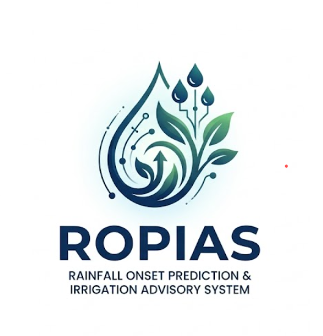
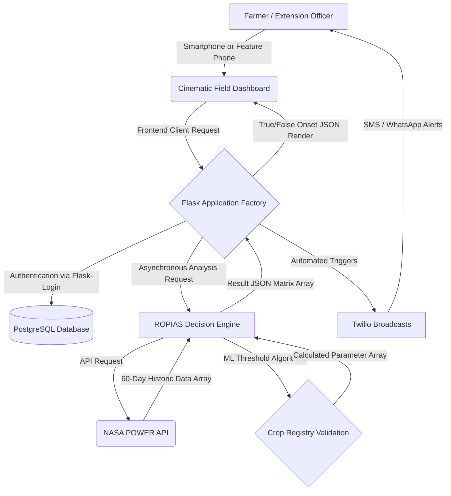

    <picture>
      <source media="(prefers-color-scheme: dark)" srcset="app/static/img/logo-dark.png">
      
    </picture>
    <h1>ROPIAS</h1>
    <h3>Rainfall Onset Prediction & Irrigation Advisory System</h3>
    
A precision data instrument protecting Kenya's smallholder farmers from crop failure.

---

## 🌍 The Mission
Traditional farming calendars across East Africa relied on predictable rainfall patterns—for example, "Plant when the long rains begin in March." Climate change has completely fractured this predictability.

**False onset events**—brief, intense rains followed by devastating 14–21 day dry spells—now routinely wipe out seeds, expensive fertilizer, and labor across the continent. 

**ROPIAS** is a sophisticated Decision Intelligence Platform that intercepts this problem. By dynamically passing a farmer's coordinates into NASA's POWER satellite API, the system algorithmically audits the last 60 days of precipitation and critical root-zone moisture (GWETROOT). Through strict agronomic thresholds customized for 37 distinctly calibrated Kenyan crops, ROPIAS issues a definitive, binary verdict: **True Onset (Safe to Plant)** or **False Onset (Wait)**.

No expensive IoT soil sensors are required. A feature-phone and a Twilio SMS/WhatsApp alert change the fate of a farmer's season.

---

## 🛠️ System Architecture & Flowchart
The application utilizes an extremely resilient, headless REST architecture decoupled from the front-end rendering engines.

---

## 🌾 Expanded Crop Coverage
ROPIAS supports the entire spectrum of Kenyan agricultural production, calibrated meticulously for each crop's physiological moisture constraints.

| Category | Examples Supported | ML/Agronomic Threshold Logic |
|---|---|---|
| **Cereals** | Maize, Wheat, Sorghum | Evaluates 20mm accumulation over 2 days against 7-day max dry-spell tolerance. |
| **Vegetables** | Tomatoes, Onions, Kale | High sensitivity to GWETROOT variables; requires >35% sustained topsoil saturation. |
| **Cash Crops** | Coffee, Tea, Sugarcane | Deep root-zone checks spanning 3-week trailing moisture vectors. |

---

## 🎨 Cinematic UI/UX & Design System
ROPIAS was completely re-architected to look less like a university project and more like a Tier-1 Bloomberg command terminal crossed with an agrarian field notebook.

- **Slate & Emerald Glassmorphism**: A highly customized system utilizing `--navy`, `--teal`, and `--accent` color variables mapping directly to psychological states (Safe/Watch/Danger).
- **Native 3-Mode Theme Engine**: The dashboard natively switches between Light, Dark, and System contexts via pure vanilla JavaScript and CSS stacking—entirely bypassing heavy Node JS wrappers.
- **Dynamic Asynchronous Dashboards**: When farmers click 'Analyze', the UI snaps to an elegant Skeleton shimmer state before dynamically injecting Chart.js modules and true/false mathematical data directly onto the screen without page reloads.

---

## 🚀 Deployment: Render (Production Ready)
ROPIAS was explicitly transitioned to deployment on **Render** (render.com) rather than Railway or PythonAnywhere. Here is why Render was elected:

1. **Native Docker / Blueprint Synergy**: Render seamlessly connects to the `render.yaml` infrastructure-as-code file present in the root directory, perfectly complementing our Flask Application Factory pattern without requiring confusing Buildpacks.
2. **First-Class PostgreSQL Provisioning**: Render allows the deployment of the Web Service and the Production PostgreSQL database simultaneously within the exact same private internal network, nullifying latency.
3. **Generous Free Tier Architecture**: The system can scale its background worker and Twilio webhook endpoints simultaneously without immediately hitting aggressive billing thresholds during the pilot phase in Western Kenya.

### Render Deployment Steps
1. Connect your GitHub repository to [Render.com](https://render.com).
2. Create a new **Web Service**.
3. **Build Command**: `pip install -r requirements.txt`
4. **Start Command**: `gunicorn -w 4 -b 0.0.0.0:10000 --timeout 120 run:app`
5. Map your Environment Variables (`FLASK_SECRET_KEY`, `DATABASE_URL`, `TWILIO_ACCOUNT_SID`, etc.) directly in the Render dashboard.

---

## 🤝 Current Status
This system is presently stable, fully interactive, and operational. 
*Architected by Francis Gachuri & the engineering framework at KCA University.*